# PHiscord

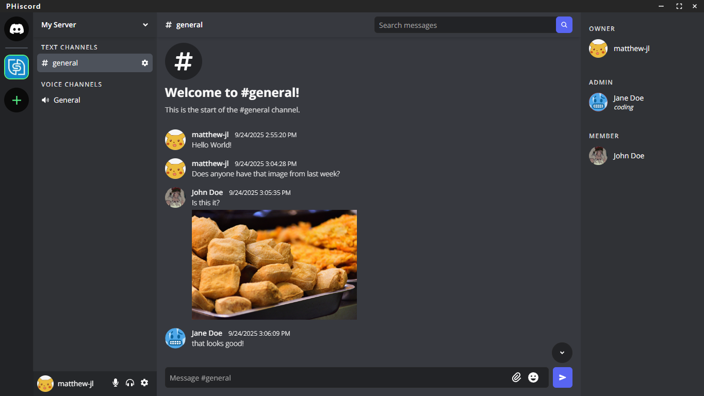

PHiscord is a Discord clone built as a desktop app using Next.js and Electron. This desktop app is complete with text, voice, and video communication with server-based communities and direct messaging.

This project was made to complete the technical test when I applied for the full-time role of Junior Laboratory Assistant at BINUS Software Laboratory Center (SLC). As a part-time laboratory assistant, this was one of my first big programming projects and a very valuable learning experience. The case was on the subject of business analysis and application, which included creating the [System Design and Architecture](#system-design) before development. I was tested by Shania Priccilia, former Resource Management Officer in BINUS SLC, and achieved a score of 92/100.

**Tech Stack:** Next.js (React), Electron (via Nextron), Firebase (Auth, Firestore, Storage, Realtime Database), LiveKit (Real-time Voice/Video), TypeScript, Tailwind CSS, Shadcn/UI.

---

###  Key Features

**Core Communication**

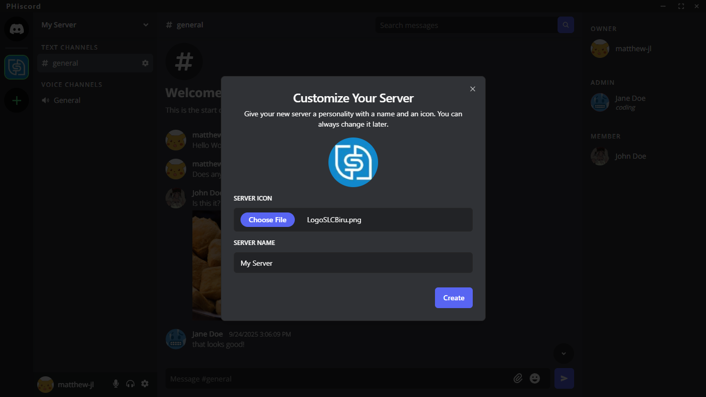
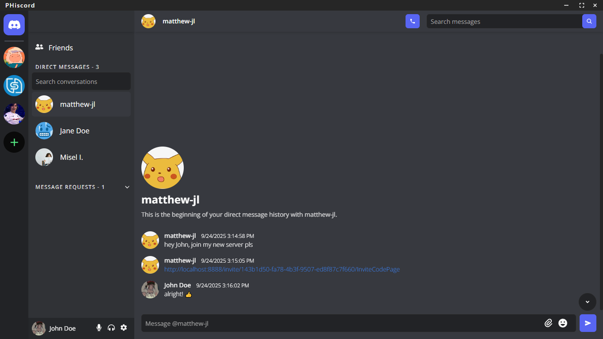
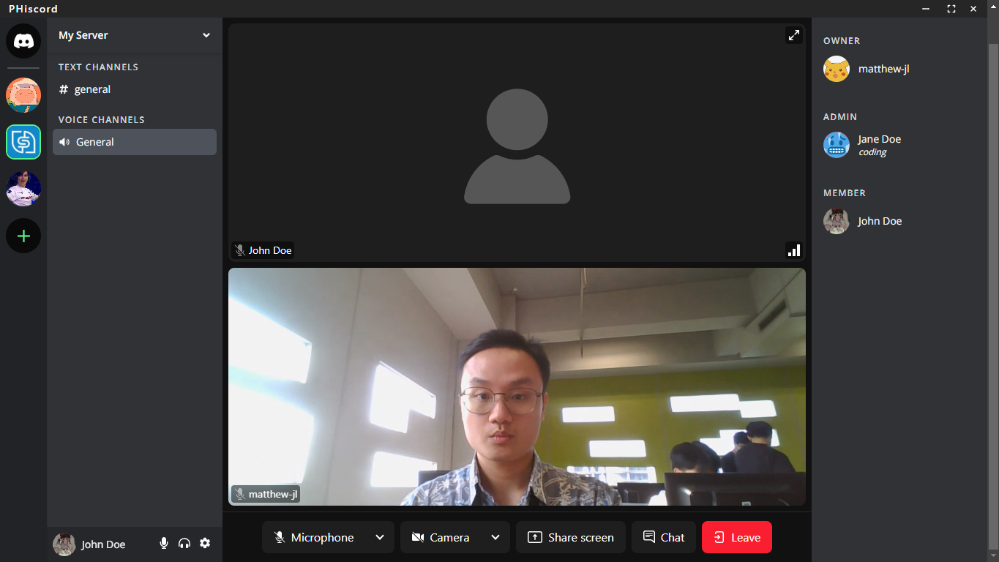

- **Servers & Channels →** Create or join servers (communities). Organize discussions within servers using distinct text and voice channels.
- **Real-time Text Chat →** Send and receive messages instantly in text channels and direct messages.
- **Real-time Voice/Video Channels →** Join voice channels for persistent group voice chat. Toggle camera for video sharing within the channel. See who's currently speaking.
- **Direct Messaging →** Engage in private one-on-one conversations with friends or other server members (respecting privacy settings).
- **Direct Voice/Video Calls →** Initiate private voice or video calls directly with other users.

**User Experience & Customization**

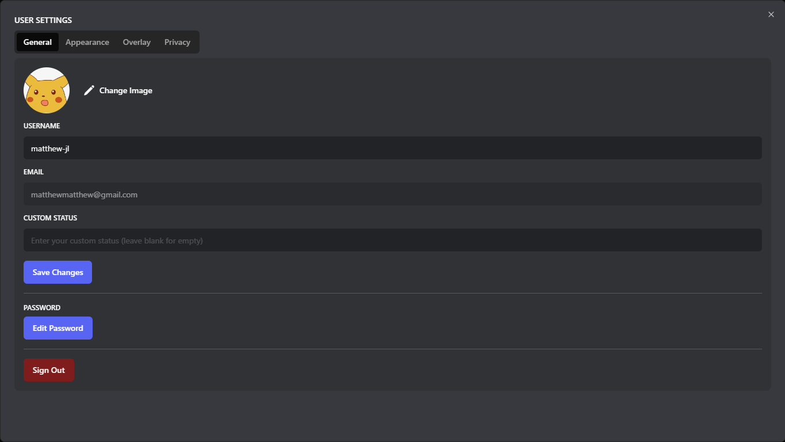
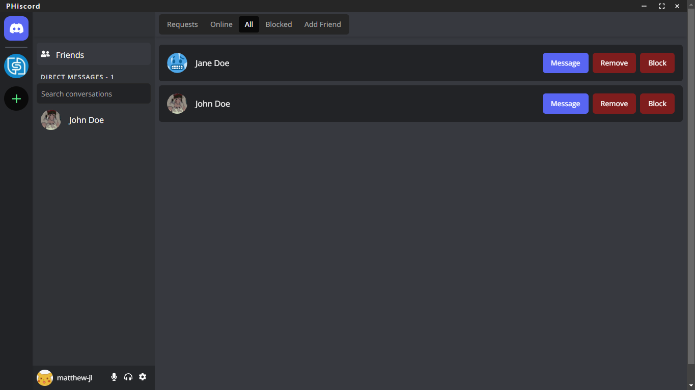

- **User Authentication →** Secure registration and login flow using Firebase Authentication.
- **User Profiles & Presence →** Manage your profile information and see the online status of friends. Set custom statuses to share what you're up to.
- **Friend System →** Add, view (by status: Online, All, Blocked), and remove friends. Block users to prevent unwanted interactions.
- **Rich Media & Interactions:**
  - Send files (images, documents) via drag-and-drop or file selection.
  - Use emojis in messages.
  - Edit and delete your own messages.
  - Mention users (`@username`) to notify them.
  - Clickable links and image previews directly in chat.
  - Message search within channels and DMs.
- **Customization:**
  - Personalize appearance with color themes and adjustable font sizes.
  - Configure privacy settings for direct messages and calls from non-friends.
  - Set custom nicknames per server.

**Server Management**

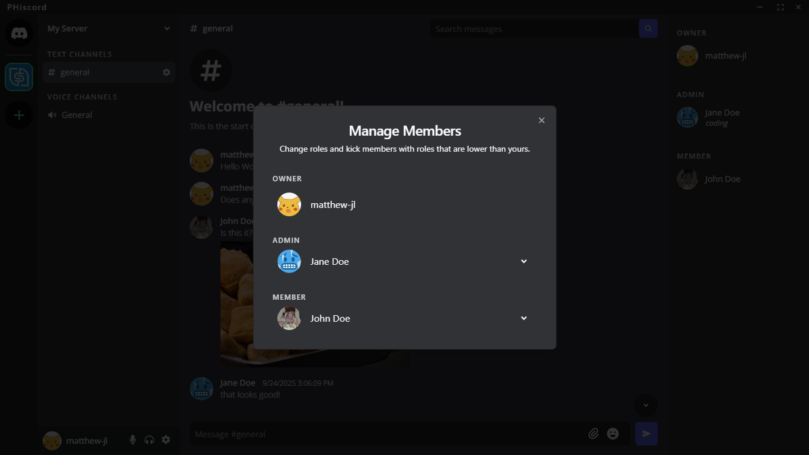
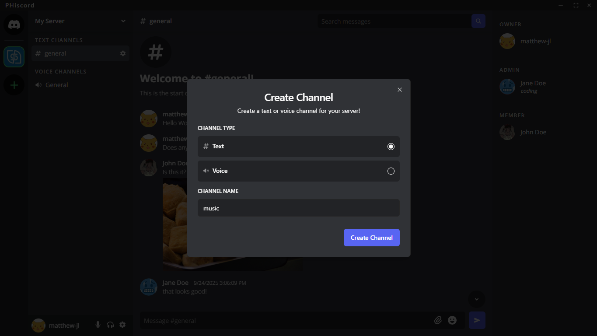

- **Role-Based Access Control →** Servers have Owners, Admins, and Members with distinct permissions for managing the server, channels, and members.
- **Channel Management →** Admins/Owners can create, edit, and delete text and voice channels.
- **Member Management →** View server members categorized by role. Admins/Owners can manage members on their server.

---

### System Design & Architecture

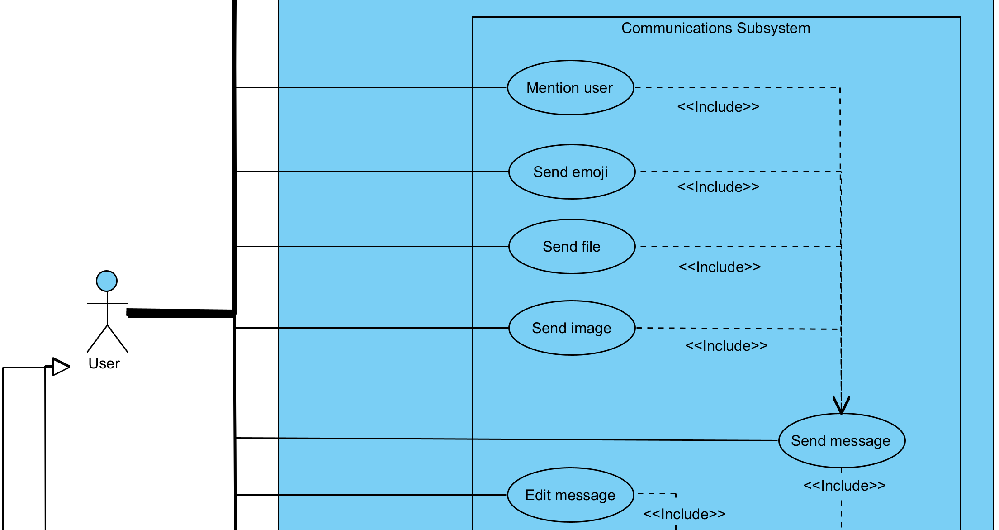
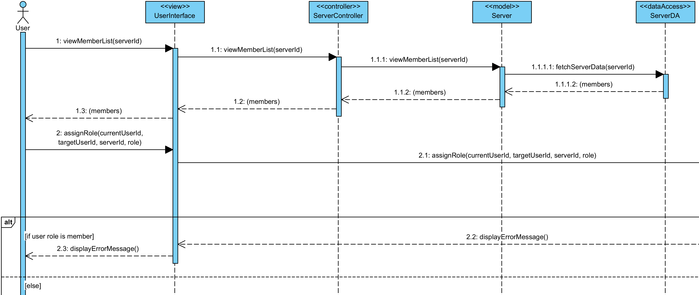
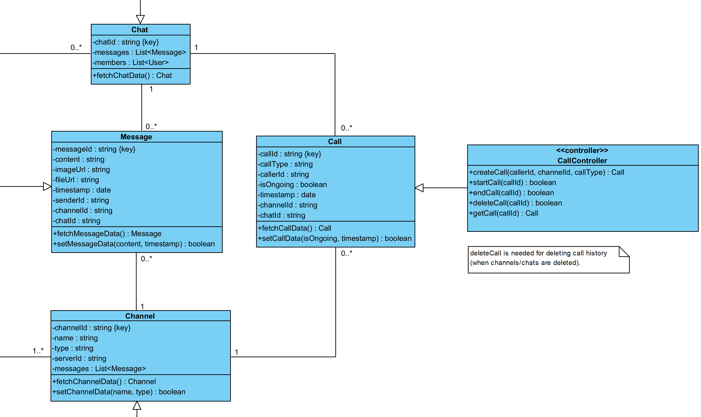

Here are the outputs of the system design phase that was done before the programming phase.

- **System Design Diagrams →** Detailed diagrams illustrating the system's architecture and user flows were created using the Satzinger concept during the planning phase. These can be found here:
  - [All Diagrams (Folder)](./diagrams/)
  - [View Use Case Diagram](./diagrams/PHiscord_UseCaseDiagram.png)
  - [Download Use Case Descriptions (Excel Workbook)](./diagrams/PHiscord_FullUseCaseDescriptions.xlsx)
  - [View Activity Diagrams](./diagrams/PHiscord_ActivityDiagrams.png)
  - [View Sequence Diagram Example](./diagrams/PHiscord_SequenceDiagram_SendFriendRequest.png)
  - [View Class Diagram](./diagrams/PHiscord_ClassDiagram.png)
- **Database Schema →** The application utilizes Firestore as its primary database. The detailed schema outlining collections, documents, and fields can be found here:
  - [View Firestore Schema](./SCHEMA.md)

